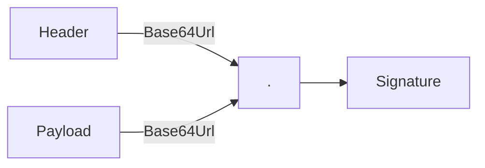
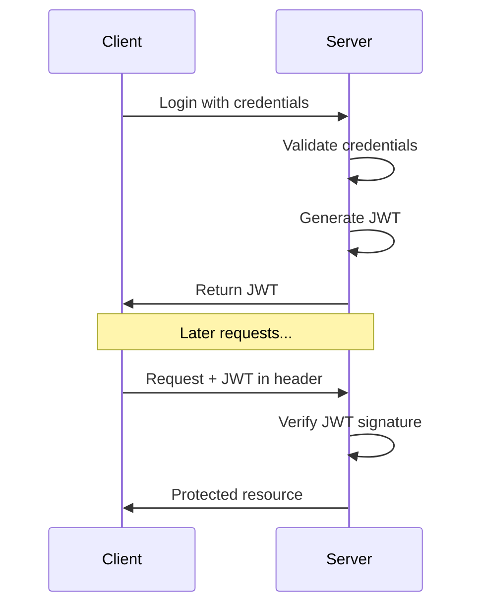
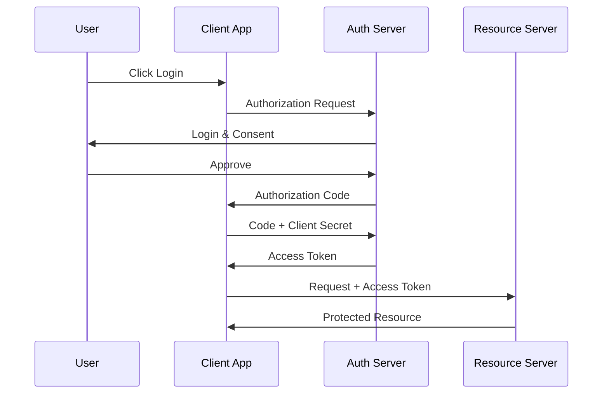
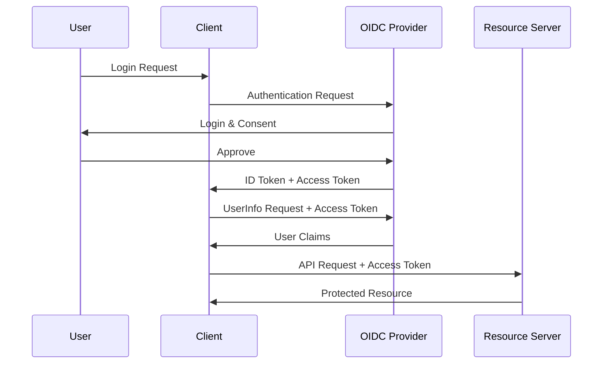
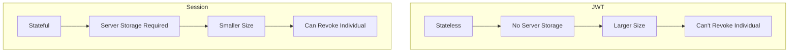
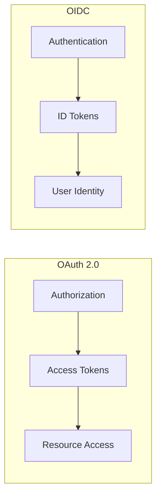

# Authentication Mechanisms

Last Updated: 2025-01-15

## JWT (JSON Web Tokens)

### Overview
JWT is a compact, URL-safe means of representing claims between parties. It's commonly used for authentication and information exchange.

### Structure
A JWT consists of three parts separated by dots:
1. Header (algorithm & token type)
2. Payload (claims)
3. Signature



### JWT Flow



### Example JWT
```javascript
// Header
{
  "alg": "HS256",
  "typ": "JWT"
}

// Payload
{
  "sub": "1234567890",
  "name": "John Doe",
  "iat": 1516239022,
  "exp": 1516242622
}
```

### Best Practices
1. Use HTTPS
2. Set appropriate expiration
3. Keep tokens secure
4. Use strong secret keys
5. Validate all claims

## OAuth 2.0

### Overview
OAuth 2.0 is an authorization framework that enables applications to obtain limited access to user accounts on other services.

### Key Terms
- Resource Owner: The user
- Client: The application
- Authorization Server: Issues tokens
- Resource Server: Hosts protected data

### Authorization Code Flow



### Grant Types
1. Authorization Code (most secure)
2. Implicit (legacy)
3. Resource Owner Password Credentials
4. Client Credentials

### Example Flow Parameters
```
// Authorization Request
https://auth-server.com/auth?
  response_type=code&
  client_id=CLIENT_ID&
  redirect_uri=https://client.com/callback&
  scope=read_profile&
  state=xyz123

// Token Request
POST /token HTTP/1.1
Host: auth-server.com
Content-Type: application/x-www-form-urlencoded

grant_type=authorization_code&
code=AUTH_CODE&
redirect_uri=https://client.com/callback&
client_id=CLIENT_ID&
client_secret=CLIENT_SECRET
```

## OpenID Connect

### Overview
OpenID Connect (OIDC) is an identity layer built on top of OAuth 2.0, adding authentication capabilities.

### Key Features
1. ID Tokens (JWT format)
2. UserInfo Endpoint
3. Standard Claims
4. Authentication Events

### Authentication Flow



### ID Token Example
```javascript
{
  "iss": "https://auth.provider.com",
  "sub": "user123",
  "aud": "client_id",
  "exp": 1516239022,
  "iat": 1516235422,
  "auth_time": 1516235422,
  "nonce": "abc123",
  "name": "John Doe",
  "email": "john@example.com"
}
```

## Comparison

### JWT vs Session Tokens



### OAuth vs OIDC



## Security Considerations

### JWT Security
1. Never store sensitive data in payload
2. Use appropriate algorithm (prefer RS256 over HS256)
3. Validate all claims
4. Set reasonable expiration times
5. Secure key management

### OAuth Security
1. Use PKCE for mobile apps
2. Validate redirect URIs
3. Use state parameter
4. Secure client secrets
5. Use short-lived tokens

### OIDC Security
1. Validate ID token claims
2. Use nonce for replay protection
3. Verify issuer and audience
4. Use HTTPS everywhere
5. Implement proper session management

## Implementation Examples

### JWT Implementation (Python)
```python
import jwt
from datetime import datetime, timedelta

def create_jwt(user_id, secret_key):
    payload = {
        'sub': str(user_id),
        'iat': datetime.utcnow(),
        'exp': datetime.utcnow() + timedelta(hours=1)
    }
    return jwt.encode(payload, secret_key, algorithm='HS256')

def verify_jwt(token, secret_key):
    try:
        payload = jwt.decode(token, secret_key, algorithms=['HS256'])
        return payload['sub']
    except jwt.ExpiredSignatureError:
        return 'Token expired'
    except jwt.InvalidTokenError:
        return 'Invalid token'
```

### OAuth Client (Python)
```python
from oauthlib.oauth2 import WebApplicationClient
import requests

client = WebApplicationClient(client_id)

def initiate_oauth_flow():
    authorization_url = client.prepare_request_uri(
        'https://auth-server.com/auth',
        redirect_uri='https://client.com/callback',
        scope=['profile', 'email'],
        state='random_state_string'
    )
    return authorization_url

def get_token(code):
    token_url = 'https://auth-server.com/token'
    token_response = requests.post(
        token_url,
        data=client.prepare_request_body(
            code=code,
            redirect_uri='https://client.com/callback'
        ),
        auth=(client_id, client_secret)
    )
    return token_response.json()
```

### OIDC Client (Python)
```python
from oic.oic import Client
from oic.utils.authn.client import CLIENT_AUTHN_METHOD

client = Client(client_authn_method=CLIENT_AUTHN_METHOD)

def initialize_oidc():
    client.provider_config(
        'https://accounts.google.com/.well-known/openid-configuration'
    )
    
    args = {
        'client_id': client_id,
        'response_type': ['code'],
        'scope': ['openid', 'profile', 'email'],
        'redirect_uri': ['https://client.com/callback'],
        'state': 'random_state_string',
        'nonce': 'random_nonce_string'
    }
    
    auth_request = client.construct_AuthorizationRequest(
        request_args=args
    )
    return auth_request.to_url()

def process_callback(response):
    args = {
        'code': response['code'],
        'state': response['state']
    }
    
    token_response = client.do_access_token_request(
        state=args['state'],
        request_args=args,
        authn_method='client_secret_basic'
    )
    
    userinfo = client.do_user_info_request(
        token=token_response['access_token']
    )
    return userinfo
```

## Best Practices Summary

### General Authentication Best Practices
1. Use HTTPS everywhere
2. Implement proper error handling
3. Rate limiting
4. Secure password storage
5. Multi-factor authentication when possible

### Token Management
1. Short lifetimes for access tokens
2. Use refresh tokens when appropriate
3. Secure token storage
4. Token rotation
5. Proper error handling

### API Security
1. Input validation
2. Output encoding
3. CORS configuration
4. Security headers
5. API versioning

## Common Pitfalls

### JWT Pitfalls
1. Storing sensitive data in tokens
2. Not validating signature
3. Using weak secrets
4. Missing expiration
5. Not handling errors

### OAuth Pitfalls
1. Skipping state parameter
2. Insecure redirect URIs
3. Exposing client secrets
4. Wrong grant type selection
5. Missing scope validation

### OIDC Pitfalls
1. Skipping nonce validation
2. Not verifying claims
3. Missing error handling
4. Incorrect flow selection
5. Poor session management
