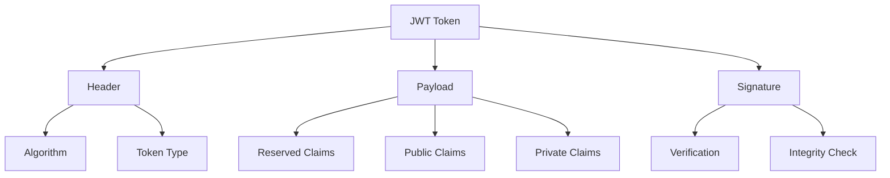
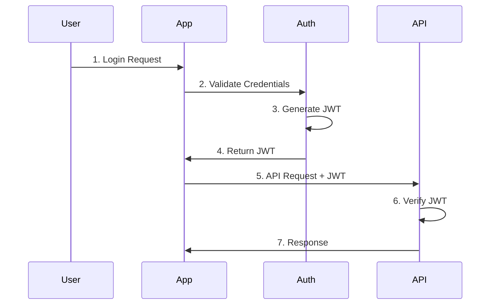
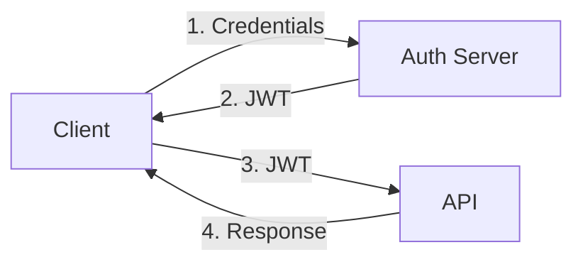
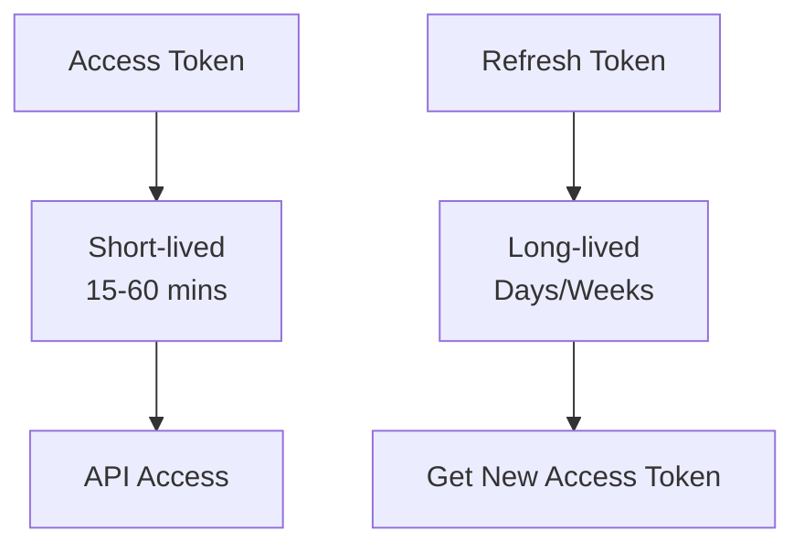
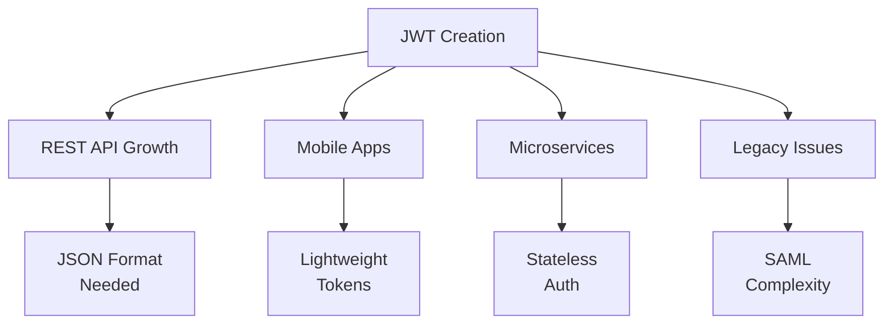

# JSON Web Tokens (JWT)

Last Updated: 2025-01-15

## Overview
JSON Web Token (JWT) is an open standard (RFC 7519) that defines a compact and self-contained way for securely transmitting information between parties as a JSON object. JWTs can be verified and trusted because they are digitally signed.

## Core Concepts

### 1. Basic Terms
- **JWT**: A secure, URL-safe means of representing claims between parties
- **Claims**: Key-value pairs of information
- **Bearer**: Entity holding the token
- **Issuer**: Service that creates the token
- **Audience**: Intended recipient of the token

### 2. Token Structure



### 3. Claims Types
1. **Reserved Claims**
   - **iss** (Issuer): Token issuer
   - **sub** (Subject): Token subject
   - **exp** (Expiration): Expiry time
   - **iat** (Issued At): Issue time
   - **aud** (Audience): Token recipient

2. **Public Claims**
   - Collision-resistant names
   - Defined in IANA Registry
   - Example: name, given_name

3. **Private Claims**
   - Custom claims
   - Agreement between parties
   - Example: user_role, permissions

## Token Lifecycle



## Authentication Patterns

### 1. Simple Authentication


### 2. Refresh Token Flow


## Implementation Examples

### Python Implementation (with PyJWT)

```python
from jwt import encode, decode, InvalidTokenError
from datetime import datetime, timedelta

class JWTHandler:
    def __init__(self, secret_key: str):
        self.secret_key = secret_key
    
    def create_token(self, user_id: str, expires_in_minutes: int = 30) -> str:
        """Create a new JWT token"""
        payload = {
            'sub': user_id,
            'iat': datetime.utcnow(),
            'exp': datetime.utcnow() + timedelta(minutes=expires_in_minutes)
        }
        return encode(payload, self.secret_key, algorithm='HS256')
    
    def verify_token(self, token: str) -> dict:
        """Verify and decode token"""
        try:
            return decode(token, self.secret_key, algorithms=['HS256'])
        except InvalidTokenError:
            raise ValueError('Invalid or expired token')
```

### JavaScript Implementation (with jsonwebtoken)

```javascript
const jwt = require('jsonwebtoken')

class JWTAuth {
    constructor(secretKey) {
        this.secretKey = secretKey
    }
    
    createToken(userId, expiresInMinutes = 30) {
        const payload = {
            sub: userId,
            iat: Math.floor(Date.now() / 1000)
        }
        
        return jwt.sign(payload, this.secretKey, {
            expiresIn: expiresInMinutes * 60
        })
    }
    
    verifyToken(token) {
        try {
            return jwt.verify(token, this.secretKey)
        } catch (err) {
            throw new Error('Invalid or expired token')
        }
    }
}
```

## Security Considerations

### 1. Token Security
- Use strong secret keys (min 256-bit)
- Set appropriate expiration times
- Never store sensitive data
- Use HTTPS for transmission
- Implement proper key rotation

### 2. Storage Security
- Store tokens securely
- Use HttpOnly cookies
- Clear tokens on logout
- Implement token blacklisting
- Monitor token usage

### 3. Implementation Security
- Validate all inputs
- Use appropriate algorithms
- Implement rate limiting
- Handle errors securely
- Log security events

## Common Vulnerabilities

### 1. Token Vulnerabilities
- Weak secret keys
- Missing expiration
- Sensitive data exposure
- Insecure transmission
- Missing signature validation

### 2. Implementation Vulnerabilities
- No token revocation
- Missing token validation
- Improper error handling
- Weak algorithms
- Token reuse

### 3. Best Practices
- Short token lifetimes
- Proper key management
- Regular security audits
- Secure token storage
- Input validation

## Common Use Cases

### 1. API Authentication
- Stateless authentication
- Microservices
- Mobile applications
- Single sign-on
- Third-party access

### 2. Information Exchange
- User claims
- Authorization data
- Session state
- Configuration data
- Temporary credentials

## Historical Context

### 1. Origins and Evolution
- Created in 2010 by Auth0's founders
- Standardized in May 2015 (RFC 7519)
- Emerged from XML-based SAML tokens
- Designed for REST/JSON environments

### 2. Key Motivations


### 3. Historical Problems Solved
- **XML Complexity**: Simplified SAML's verbose XML
- **Mobile Optimization**: Reduced token size for mobile
- **API Integration**: Better REST API compatibility
- **Cross-Domain**: Easier cross-origin sharing
- **Processing Speed**: Faster than XML parsing

### 4. Industry Impact
- Rapid adoption in web services
- De facto standard for APIs
- Influenced OAuth 2.0 flows
- Spawned numerous libraries
- Created token-based auth pattern
