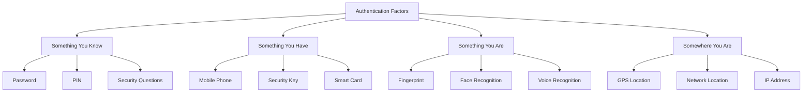
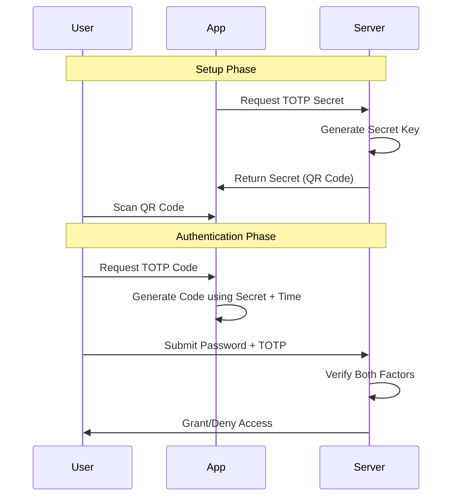
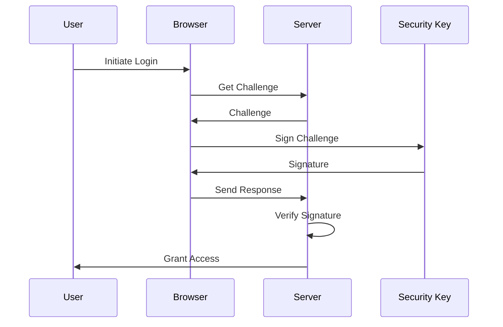
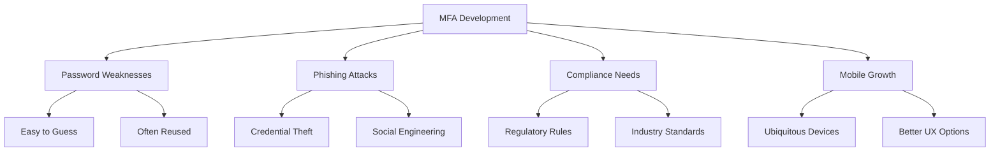

# Multi-Factor Authentication (MFA)

Last Updated: 2025-01-15

## Overview
Multi-Factor Authentication (MFA) is a security system that requires users to provide two or more verification factors to gain access to a resource. This significantly increases security as compromising multiple authentication factors is more difficult than compromising a single factor.

## Core Concepts

### 1. Basic Terms
- **MFA**: Authentication using multiple independent factors
- **2FA**: Two-factor authentication, a subset of MFA
- **Factor**: A distinct category of authentication method
- **TOTP**: Time-based One-Time Password
- **WebAuthn**: Web Authentication standard

### 2. Authentication Factors



### 3. Key Principles
- Multiple independent factors
- Defense in depth
- User-friendly experience
- Secure fallback options
- Risk-based approach

## Authentication Methods

### 1. TOTP (Time-based One-Time Password)



**Characteristics:**
- Time-synchronized codes
- 30-second validity
- Offline operation
- Authenticator app required
- QR code setup

### 2. Security Keys (FIDO2/WebAuthn)



**Characteristics:**
- Physical security keys
- Phishing-resistant
- Public key cryptography
- Browser support required
- No shared secrets

### 3. SMS/Email Verification
- Codes sent via SMS/email
- Widely supported
- Network dependent
- Vulnerable to interception
- Cost considerations

## Implementation Examples

### Python Implementation (with pyotp)

```python
from flask import Flask
import pyotp
import qrcode

class MFAManager:
    def setup_totp(self, user_id: str) -> dict:
        """Set up TOTP-based MFA"""
        secret = pyotp.random_base32()
        totp = pyotp.TOTP(secret)
        
        uri = totp.provisioning_uri(
            user_id,
            issuer_name="YourApp"
        )
        
        return {
            'secret': secret,
            'uri': uri
        }
    
    def verify_totp(self, secret: str, code: str) -> bool:
        """Verify TOTP code"""
        totp = pyotp.TOTP(secret)
        return totp.verify(code)
```

### JavaScript Implementation (with speakeasy)

```javascript
const speakeasy = require('speakeasy');
const QRCode = require('qrcode');

class MFAHandler {
    setupTOTP(userId) {
        const secret = speakeasy.generateSecret({
            name: `YourApp (${userId})`
        });
        
        return {
            secret: secret.base32,
            uri: secret.otpauth_url
        };
    }
    
    verifyTOTP(secret, token) {
        return speakeasy.totp.verify({
            secret,
            encoding: 'base32',
            token
        });
    }
}
```

## Security Considerations

### 1. Implementation Security
- Rate limit attempts
- Implement secure recovery
- Use secure communication
- Monitor for attacks
- Log security events

### 2. User Security
- Backup codes provision
- Clear documentation
- Device management
- Session handling
- Account recovery

### 3. System Security
- Secure secret storage
- Audit logging
- Compliance requirements
- Key rotation
- Incident response

## Common Use Cases

### 1. User Authentication
- Login protection
- Account recovery
- Password resets
- Profile changes
- Financial transactions

### 2. System Access
- Admin interfaces
- API access
- VPN connections
- Cloud services
- Database access

## Historical Context

### 1. Origins and Evolution
- Started with hardware tokens
- Moved to software tokens
- Mobile revolution impact
- Rise of biometrics
- Modern standards emergence

### 2. Key Motivations


### 3. Industry Impact
- Standard security practice
- Reduced account takeovers
- Enhanced compliance
- Improved user trust
- Mobile-first authentication
