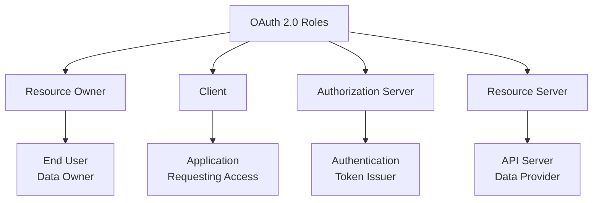
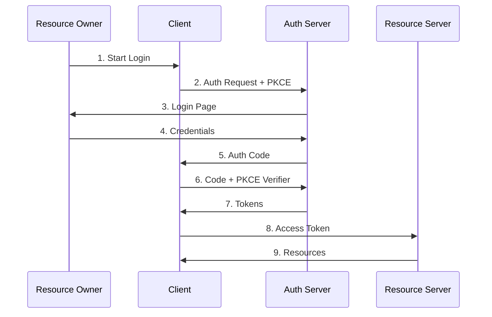
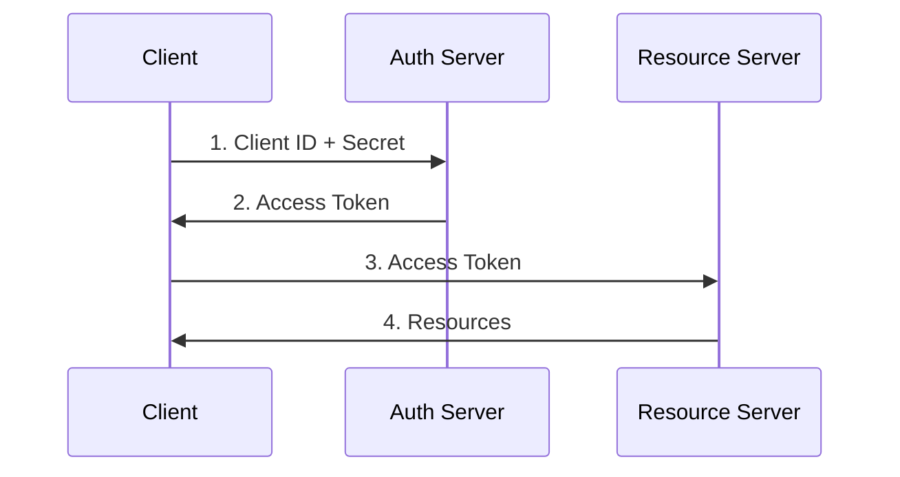
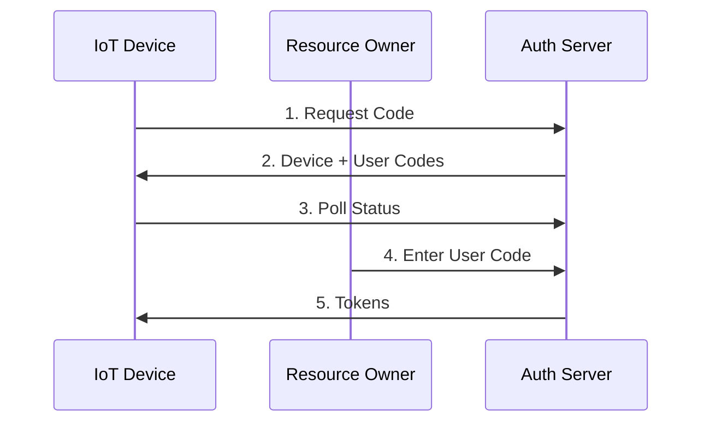

# OAuth 2.0

Last Updated: 2025-01-15

## Overview
OAuth 2.0 is the industry-standard protocol for authorization. It focuses on client developer simplicity while providing specific authorization flows for web applications, desktop applications, mobile phones, and IoT devices.

## Core Concepts

### 1. Basic Terms
- **Authorization**: Granting access to resources
- **Authentication**: Verifying user identity
- **Scope**: Permission level being requested
- **Token**: Credential used to access resources
- **Grant**: Method of obtaining authorization

### 2. Key Roles



### 3. Token Types
- **Access Token**: Short-lived credential for API access
- **Refresh Token**: Long-lived token to get new access tokens
- **ID Token**: Contains user identity information
- **Bearer Token**: Token that grants access to holder
- **JWT**: Signed token containing claims

## Authorization Flows

### 1. Authorization Code Flow (Most Secure)



**Best For:**
- Web applications
- Mobile apps
- Single page applications
- Native applications

### 2. Client Credentials Flow



**Best For:**
- Machine-to-machine
- Backend services
- Microservices
- Daemon applications

### 3. Device Code Flow



**Best For:**
- IoT devices
- Smart TVs
- CLI applications
- Limited input devices

## Security Considerations

### 1. PKCE (Proof Key for Code Exchange)
- Prevents authorization code interception
- Required for public clients
- Recommended for all clients
- Uses code challenge and verifier
- Protects against CSRF attacks

### 2. Token Security
- Use short-lived access tokens
- Secure token storage
- Validate token signatures
- Implement token revocation
- Monitor token usage

### 3. Best Practices
- Always use HTTPS
- Validate all inputs
- Implement state parameter
- Use appropriate scopes
- Regular security audits

## Implementation Examples

### Python Implementation (with requests-oauthlib)

```python
from requests_oauthlib import OAuth2Session
import secrets

class OAuth2Client:
    def __init__(self, client_id: str, client_secret: str, auth_url: str, token_url: str):
        self.client_id = client_id
        self.client_secret = client_secret
        self.auth_url = auth_url
        self.token_url = token_url
        
    def get_authorization_url(self, redirect_uri: str, scope: list) -> tuple:
        """Get authorization URL with PKCE"""
        oauth = OAuth2Session(
            client_id=self.client_id,
            redirect_uri=redirect_uri,
            scope=scope
        )
        
        # Generate PKCE challenge
        code_verifier = secrets.token_urlsafe(64)
        authorization_url, state = oauth.authorization_url(
            self.auth_url,
            code_challenge=code_verifier,
            code_challenge_method='S256'
        )
        
        return authorization_url, state, code_verifier
    
    def fetch_token(self, redirect_uri: str, code: str, code_verifier: str) -> dict:
        """Exchange code for tokens"""
        oauth = OAuth2Session(
            client_id=self.client_id,
            redirect_uri=redirect_uri
        )
        
        token = oauth.fetch_token(
            token_url=self.token_url,
            client_secret=self.client_secret,
            code=code,
            code_verifier=code_verifier
        )
        
        return token
```

### JavaScript Implementation (with oauth4webapi)

```javascript
import { authorizationCodeGrantRequest, generateCodeVerifier } from 'oauth4webapi'

class OAuth2Client {
    constructor(config) {
        this.config = {
            clientId: config.clientId,
            authUrl: config.authUrl,
            tokenUrl: config.tokenUrl,
            redirectUri: config.redirectUri
        }
    }
    
    async getAuthorizationUrl() {
        // Generate PKCE
        const codeVerifier = generateCodeVerifier()
        const codeChallenge = await crypto.subtle.digest(
            'SHA-256',
            new TextEncoder().encode(codeVerifier)
        )
        
        // Build URL
        const params = new URLSearchParams({
            client_id: this.config.clientId,
            response_type: 'code',
            redirect_uri: this.config.redirectUri,
            code_challenge: btoa(String.fromCharCode(...new Uint8Array(codeChallenge)))
                .replace(/=/g, '')
                .replace(/\+/g, '-')
                .replace(/\//g, '_'),
            code_challenge_method: 'S256'
        })
        
        return {
            url: `${this.config.authUrl}?${params}`,
            codeVerifier
        }
    }
    
    async fetchToken(code, codeVerifier) {
        const response = await authorizationCodeGrantRequest(
            this.config.tokenUrl,
            {
                client_id: this.config.clientId,
                code,
                code_verifier: codeVerifier,
                redirect_uri: this.config.redirectUri
            }
        )
        
        return response.json()
    }
}
```

## Common Vulnerabilities

### 1. Implementation Risks
- Missing PKCE
- Token exposure
- Insecure storage
- Weak validation
- CSRF attacks

### 2. Configuration Risks
- Overly broad scopes
- Missing redirect validation
- Weak client secrets
- Insecure endpoints
- Token leakage

### 3. Operational Risks
- No token revocation
- Missing monitoring
- Poor error handling
- Weak access controls
- Insufficient logging
