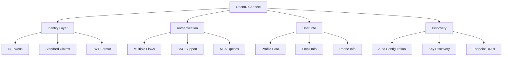
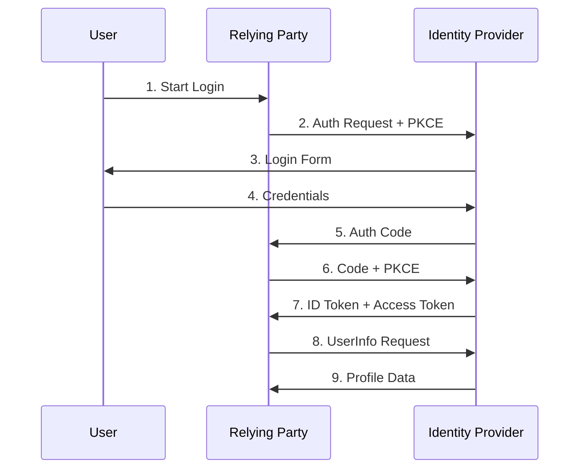
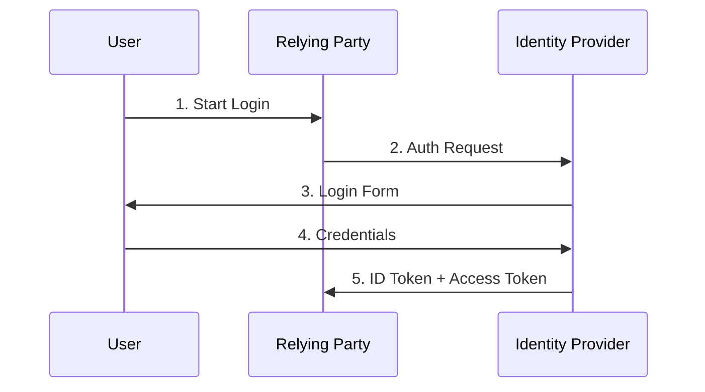
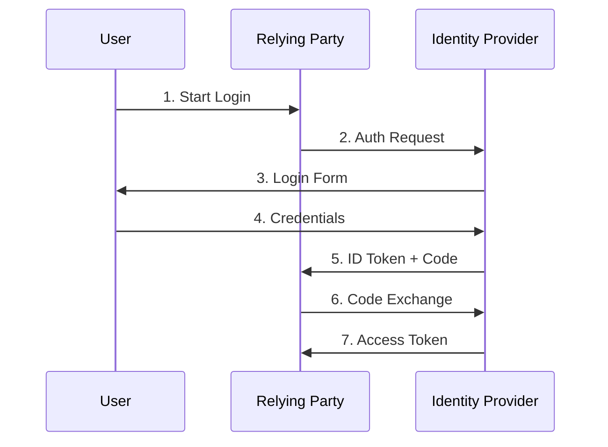

# OpenID Connect (OIDC)

Last Updated: 2025-01-15

## Overview
OpenID Connect (OIDC) is an identity layer built on top of OAuth 2.0. It allows clients to verify the identity of end-users and obtain basic profile information in an interoperable way.

## Core Concepts

### 1. Basic Terms
- **Identity Provider (IDP)**: Issues identity tokens
- **Relying Party (RP)**: Application using OIDC
- **End-User**: Person being authenticated
- **ID Token**: JWT containing user identity
- **UserInfo Endpoint**: Profile data API

### 2. Key Components



### 3. Scopes and Claims
- **openid**: Required base scope
- **profile**: Name, username, picture
- **email**: Email address and status
- **phone**: Phone number and status
- **address**: Postal address info

## Authentication Flows

### 1. Authorization Code Flow



**Best For:**
- Web applications
- Mobile apps
- Server-side apps
- Native applications

### 2. Implicit Flow (Legacy)



**Not Recommended Due To:**
- Security concerns
- Token exposure risks
- No refresh tokens
- Limited to browsers

### 3. Hybrid Flow



**Best For:**
- Native applications
- JavaScript apps with backends
- Enhanced security needs
- Complex architectures

## ID Token Structure

### 1. Required Claims
- **iss**: Token issuer
- **sub**: Subject identifier
- **aud**: Client ID
- **exp**: Expiration time
- **iat**: Issued at time

### 2. Optional Claims
- **auth_time**: Authentication time
- **nonce**: Prevents replay
- **acr/amr**: Auth context
- **azp**: Authorized party

### 3. User Claims
- **name**: Full name
- **email**: Email address
- **picture**: Profile picture
- **locale**: Language preference
- **phone_number**: Phone number

## Implementation Examples

### Python Implementation (with oic)

```python
from oic.oic import Client
from oic.utils.authn.client import CLIENT_AUTHN_METHOD
import time

class OIDCAuthentication:
    def __init__(self, client_id: str, client_secret: str, issuer: str):
        self.client = Client(client_id=client_id)
        self.client.provider_config(issuer)
        self.client_secret = client_secret
        
    def get_authentication_url(self, redirect_uri: str) -> str:
        """Generate authentication URL with PKCE"""
        auth_args = {
            'client_id': self.client.client_id,
            'response_type': 'code',
            'scope': ['openid', 'profile', 'email'],
            'redirect_uri': redirect_uri,
            'state': self._generate_state(),
            'nonce': self._generate_nonce()
        }
        
        return self.client.construct_AuthorizationRequest(
            request_args=auth_args
        ).to_url()
    
    def handle_callback(self, code: str, state: str) -> dict:
        """Process authentication callback"""
        # Exchange code for tokens
        token_response = self.client.do_access_token_request(
            scope=['openid', 'profile', 'email'],
            state=state,
            request_args={
                'code': code,
                'client_secret': self.client_secret
            }
        )
        
        # Get user info
        userinfo = self.client.do_user_info_request(
            token=token_response['access_token']
        )
        
        return {
            'id_token': token_response['id_token'],
            'userinfo': userinfo
        }
```

### JavaScript Implementation (with oidc-client)

```javascript
import { UserManager } from 'oidc-client-ts'

class OIDCAuth {
    constructor(config) {
        this.userManager = new UserManager({
            authority: config.authority,
            client_id: config.clientId,
            redirect_uri: config.redirectUri,
            response_type: 'code',
            scope: 'openid profile email',
            loadUserInfo: true
        })
    }
    
    async login() {
        try {
            await this.userManager.signinRedirect()
        } catch (err) {
            console.error('Login failed:', err)
            throw err
        }
    }
    
    async handleCallback() {
        try {
            const user = await this.userManager.signinRedirectCallback()
            return {
                idToken: user.id_token,
                profile: user.profile,
                accessToken: user.access_token
            }
        } catch (err) {
            console.error('Callback failed:', err)
            throw err
        }
    }
    
    async logout() {
        try {
            await this.userManager.signoutRedirect()
        } catch (err) {
            console.error('Logout failed:', err)
            throw err
        }
    }
}
```

## Security Considerations

### 1. Token Security
- Validate all tokens
- Check signature and claims
- Use appropriate algorithms
- Implement nonce validation
- Monitor token usage

### 2. Implementation Security
- Use HTTPS everywhere
- Implement PKCE
- Validate redirect URIs
- Secure token storage
- Regular security audits

### 3. Best Practices
- Short token lifetimes
- Rotate signing keys
- Validate all inputs
- Monitor for attacks
- Regular updates

## Common Vulnerabilities

### 1. Implementation Risks
- Missing token validation
- Weak signature verification
- Insecure token storage
- Poor error handling
- Missing nonce checks

### 2. Configuration Risks
- Overly permissive scopes
- Weak signature algorithms
- Missing redirect validation
- Insecure communication
- Poor key management

### 3. Operational Risks
- No monitoring
- Missing logging
- Poor key rotation
- Weak access controls
- Insufficient auditing
