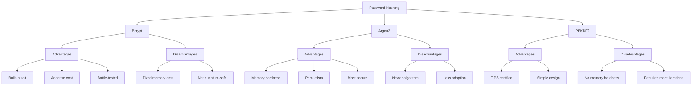
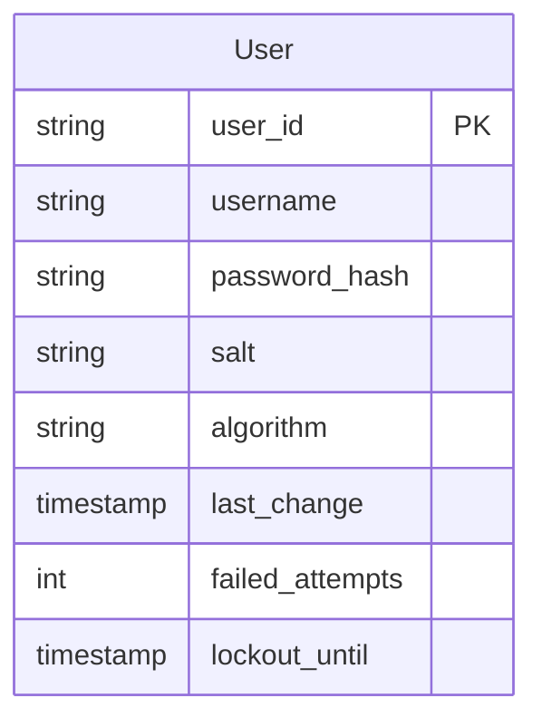

# Password Management

Last Updated: 2025-01-15

## Overview
Password management involves securely handling user passwords through proper hashing, storage, and validation techniques. This document covers best practices for implementing secure password systems.

## Core Concepts

### 1. Password Hashing
- One-way transformation of passwords
- Makes original password unrecoverable
- Includes random salt to prevent rainbow tables
- Uses work factors to slow down brute-force attacks
- Different from encryption (which is reversible)

### 2. Salt
- Random data added to password before hashing
- Unique per password
- Prevents pre-computed attacks
- Makes identical passwords hash differently
- Should be at least 16 bytes long

### 3. Work Factor
- Controls computational cost of hashing
- Higher factor means more security
- Must balance security vs performance
- Should be adjusted as hardware improves
- Different for each hashing algorithm

## Hashing Algorithms



## Password Storage

### Database Schema



### Security Considerations
1. **Hash Storage**
   - Store hash and salt separately
   - Use appropriate column types
   - Never store plain passwords
   - Include algorithm identifier

2. **Access Control**
   - Limit database access
   - Encrypt connections
   - Regular backups
   - Audit logging

## Password Policies

### 1. Complexity Requirements
- Minimum length (12+ characters)
- Mix of character types
- No common patterns
- Check against breached passwords
- Allow very long passwords

### 2. Password Changes
- Don't force regular changes
- Change on compromise
- Prevent password reuse
- Allow easy changes
- Secure reset process

### 3. Account Protection
- Account lockout after failures
- Progressive delays
- Notify on changes
- Monitor suspicious activity
- Require 2FA for sensitive actions

## Implementation Examples

### Python Implementation (with Bcrypt)

```python
import bcrypt
from typing import Tuple
from datetime import datetime, timedelta

class PasswordManager:
    def __init__(self, rounds: int = 12):
        self.rounds = rounds
    
    def hash_password(self, password: str) -> str:
        """Hash a password with bcrypt"""
        salt = bcrypt.gensalt(rounds=self.rounds)
        password_hash = bcrypt.hashpw(
            password.encode('utf-8'),
            salt
        )
        return password_hash.decode('utf-8')
    
    def verify_password(
        self,
        password: str,
        password_hash: str
    ) -> bool:
        """Verify a password"""
        try:
            return bcrypt.checkpw(
                password.encode('utf-8'),
                password_hash.encode('utf-8')
            )
        except Exception:
            return False
    
    def validate_password(self, password: str) -> bool:
        """Validate password strength"""
        if len(password) < 12:
            return False
        
        has_upper = any(c.isupper() for c in password)
        has_lower = any(c.islower() for c in password)
        has_digit = any(c.isdigit() for c in password)
        has_special = any(not c.isalnum() for c in password)
        
        return has_upper and has_lower and has_digit and has_special
```

### JavaScript Implementation (with Argon2)

```javascript
const argon2 = require('argon2');

class PasswordManager {
    constructor(options = {}) {
        this.options = {
            timeCost: options.timeCost || 2,
            memoryCost: options.memoryCost || 2**16,
            parallelism: options.parallelism || 1,
            type: argon2.argon2id
        };
    }
    
    async hashPassword(password) {
        try {
            return await argon2.hash(password, this.options);
        } catch (err) {
            throw new Error('Password hashing failed');
        }
    }
    
    async verifyPassword(password, hash) {
        try {
            return await argon2.verify(hash, password);
        } catch (err) {
            return false;
        }
    }
    
    validatePassword(password) {
        const minLength = 12;
        const hasUpper = /[A-Z]/.test(password);
        const hasLower = /[a-z]/.test(password);
        const hasDigit = /\d/.test(password);
        const hasSpecial = /[^A-Za-z0-9]/.test(password);
        
        return password.length >= minLength &&
               hasUpper && hasLower &&
               hasDigit && hasSpecial;
    }
}
```

## Best Practices

### 1. Security
- Use strong hashing algorithms
- Implement proper salting
- Set appropriate work factors
- Regular security audits
- Monitor for breaches

### 2. User Experience
- Clear password requirements
- Password strength meter
- Easy password changes
- Simple reset process
- Helpful error messages

### 3. Operations
- Monitor hash timings
- Adjust work factors
- Regular backups
- Incident response plan
- Staff training

## Common Vulnerabilities

### 1. Implementation Risks
- Weak hashing algorithms
- Insufficient salt length
- Low work factors
- Plain text storage
- Reversible encryption

### 2. Policy Risks
- Short passwords allowed
- No breach checking
- Excessive complexity rules
- Forced regular changes
- Password hints

### 3. Operational Risks
- No monitoring
- Weak reset process
- Poor access controls
- Unencrypted backups
- Insufficient logging
