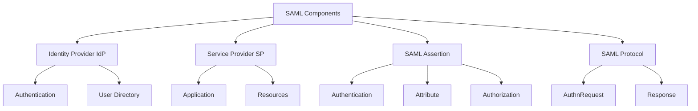
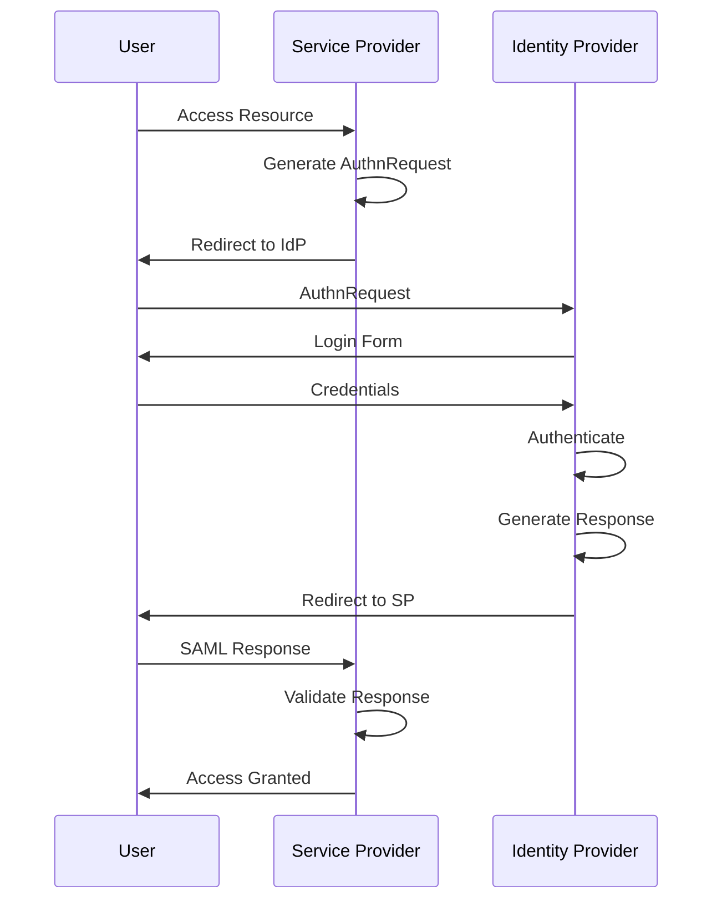
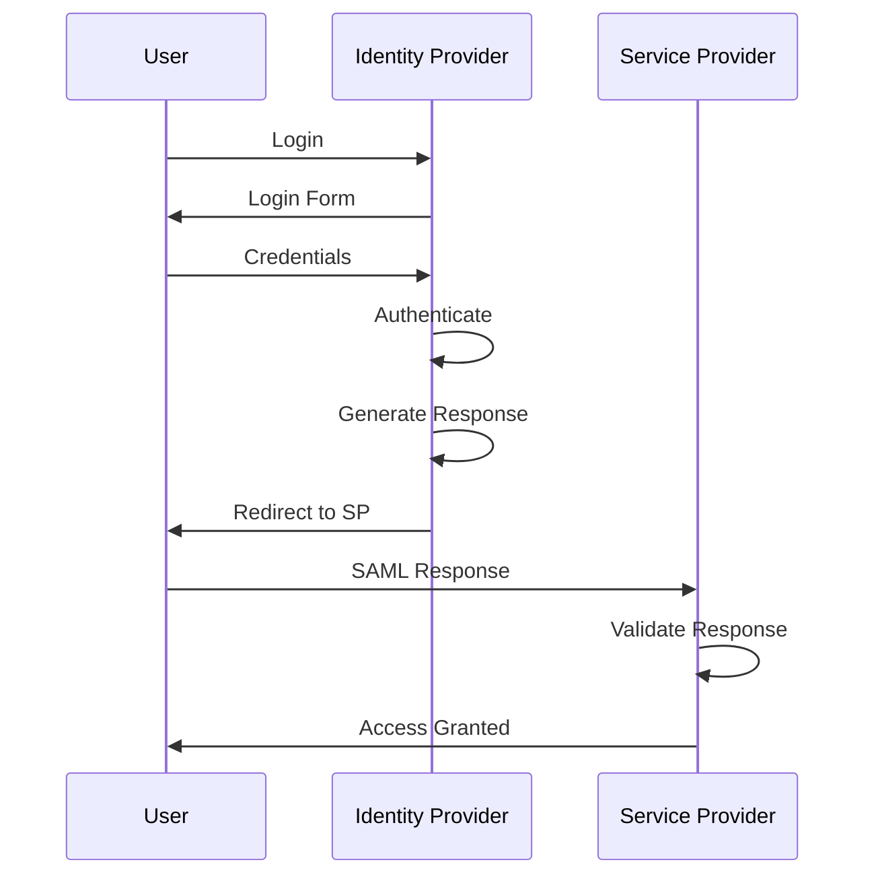
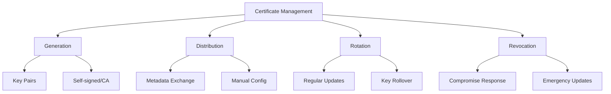

# Security Assertion Markup Language (SAML)

Last Updated: 2025-01-15

## Overview
SAML is an XML-based framework for exchanging authentication and authorization data between parties. It enables Single Sign-On (SSO) between different systems, allowing users to access multiple applications with a single login.

## Key Components



### Identity Provider (IdP)
- Authenticates users and maintains user directory
- Issues SAML assertions about user identity
- Examples: Okta, Azure AD, OneLogin

### Service Provider (SP)
- Applications or services that users want to access
- Relies on IdP for authentication
- Examples: Salesforce, AWS, Google Workspace

### SAML Assertion
A security token that contains:
1. Authentication statements (user identity)
2. Attribute statements (user properties)
3. Authorization statements (user permissions)

## Authentication Flows

### 1. SP-Initiated Flow



Common Use Cases:
1. User clicks a bookmark to an application
2. User accesses application directly
3. User follows a link to a protected resource

### 2. IdP-Initiated Flow



Common Use Cases:
1. User accesses application through IdP portal
2. User clicks app icon in IdP dashboard
3. Automated application access

## Key Concepts

### 1. SAML Assertions
Types of statements:
- **Authentication**: Confirms user identity
- **Attribute**: Provides user information
- **Authorization**: Defines user permissions

### 2. Bindings
Methods for transporting SAML messages:
- HTTP Redirect (GET)
- HTTP POST
- HTTP Artifact
- SOAP

### 3. Profiles
Standard use cases and requirements:
- Web Browser SSO Profile
- Enhanced Client/Proxy Profile
- Identity Provider Discovery Profile

## Security Considerations

### 1. XML Signature
- Ensures message integrity
- Verifies message origin
- Prevents tampering

### 2. XML Encryption
- Protects sensitive information
- Encrypts assertions
- Secures attributes

### 3. Certificate Management


### 4. Security Best Practices
1. Always use HTTPS
2. Validate signatures
3. Check assertion conditions
4. Implement replay prevention
5. Monitor for security events

## Implementation Examples

### Python Implementation with python3-saml

```python
from onelogin.saml2.auth import OneLogin_Saml2_Auth
from onelogin.saml2.settings import OneLogin_Saml2_Settings
from flask import Flask, request, session

app = Flask(__name__)
app.secret_key = 'your-secret-key'

# SAML settings
saml_settings = {
    "strict": True,
    "debug": True,
    "sp": {
        "entityId": "your-app-entity-id",
        "assertionConsumerService": {
            "url": "https://your-app.com/acs",
            "binding": "urn:oasis:names:tc:SAML:2.0:bindings:HTTP-POST"
        },
        "singleLogoutService": {
            "url": "https://your-app.com/sls",
            "binding": "urn:oasis:names:tc:SAML:2.0:bindings:HTTP-Redirect"
        },
        "x509cert": "",
        "privateKey": ""
    },
    "idp": {
        "entityId": "https://your-idp.com/metadata",
        "singleSignOnService": {
            "url": "https://your-idp.com/sso",
            "binding": "urn:oasis:names:tc:SAML:2.0:bindings:HTTP-Redirect"
        },
        "singleLogoutService": {
            "url": "https://your-idp.com/sls",
            "binding": "urn:oasis:names:tc:SAML:2.0:bindings:HTTP-Redirect"
        },
        "x509cert": "YOUR-IDP-CERTIFICATE"
    }
}

def init_saml_auth(req):
    auth = OneLogin_Saml2_Auth(req, saml_settings)
    return auth

@app.route('/login')
def login():
    req = prepare_flask_request(request)
    auth = init_saml_auth(req)
    return redirect(auth.login())

@app.route('/acs', methods=['POST'])
def acs():
    req = prepare_flask_request(request)
    auth = init_saml_auth(req)
    auth.process_response()
    errors = auth.get_errors()
    
    if not errors:
        session['samlUserdata'] = auth.get_attributes()
        session['samlNameId'] = auth.get_nameid()
        return redirect(url_for('dashboard'))
    else:
        return "SAML Authentication Failed"

def prepare_flask_request(request):
    # Helper to format request data
    return {
        'https': 'on' if request.scheme == 'https' else 'off',
        'http_host': request.host,
        'script_name': request.path,
        'get_data': request.args.copy(),
        'post_data': request.form.copy()
    }
```

### Node.js Implementation with passport-saml

```javascript
const express = require('express');
const passport = require('passport');
const SamlStrategy = require('passport-saml').Strategy;

const app = express();

// Configure SAML Strategy
const samlStrategy = new SamlStrategy(
  {
    callbackUrl: 'https://your-app.com/login/callback',
    entryPoint: 'https://your-idp.com/sso',
    issuer: 'your-app-entity-id',
    cert: 'IDP-CERTIFICATE',
    privateKey: fs.readFileSync('/path/to/private.key', 'utf-8')
  },
  function(profile, done) {
    // Verify user
    return done(null, {
      id: profile.nameID,
      email: profile.email,
      name: profile.name
    });
  }
);

passport.use(samlStrategy);

// Routes
app.get('/login',
  passport.authenticate('saml', { 
    failureRedirect: '/',
    failureFlash: true 
  })
);

app.post('/login/callback',
  passport.authenticate('saml', { 
    failureRedirect: '/',
    failureFlash: true 
  }),
  function(req, res) {
    res.redirect('/dashboard');
  }
);

// Metadata endpoint for IdP configuration
app.get('/metadata',
  function(req, res) {
    res.type('application/xml');
    res.send(samlStrategy.generateServiceProviderMetadata());
  }
);
```

### Key Implementation Considerations

1. **Certificate Management**
   - Keep private keys secure
   - Implement certificate rotation
   - Monitor certificate expiration

2. **Security Headers**
   ```python
   # Example security headers
   headers = {
       'Strict-Transport-Security': 'max-age=31536000; includeSubDomains',
       'X-Frame-Options': 'DENY',
       'X-XSS-Protection': '1; mode=block',
       'X-Content-Type-Options': 'nosniff'
   }
   ```

3. **Error Handling**
   ```python
   def handle_saml_error(auth):
       errors = auth.get_errors()
       if errors:
           if 'invalid_response' in errors:
               return "Invalid SAML response"
           elif 'invalid_signature' in errors:
               return "Invalid signature"
           else:
               return f"SAML error: {', '.join(errors)}"
   ```

4. **Logging**
   ```python
   import logging

   logging.basicConfig(level=logging.INFO)
   logger = logging.getLogger('saml')

   def log_saml_event(event_type, details):
       logger.info(f"SAML {event_type}: {details}")
   ```

## Troubleshooting Guide

### Common Issues
1. **Certificate Problems**
   - Expired Certificates
   - Invalid Signatures
   - Wrong Key Usage

2. **Configuration Issues**
   - Incorrect Endpoints
   - Mismatched Entity IDs
   - Wrong Bindings

3. **Protocol Issues**
   - Invalid SAML Requests
   - Malformed Responses
   - Timing Problems

### Debugging Steps
1. Check SAML Response
2. Verify Certificates
3. Validate Configuration
4. Test Connectivity
5. Review Logs

## Best Practices

### 1. Security
- Use strong certificates
- Implement proper encryption
- Regular security audits
- Monitor for threats

### 2. Implementation
- Follow SAML standards
- Use tested libraries
- Maintain documentation
- Regular testing

### 3. Operations
- Monitor performance
- Track usage patterns
- Regular maintenance
- Incident response plan

## Industry Standards

### 1. Compliance Requirements
- SOC 2
- ISO 27001
- GDPR
- HIPAA

### 2. Technical Standards
- SAML 2.0
- XML Signature
- XML Encryption
- X.509 Certificates

## Future Developments

### 1. Emerging Trends
- SAML with OAuth/OIDC
- Mobile Applications
- Cloud Integration
- Zero Trust Security

### 2. Industry Changes
- Enhanced Security
- Better Interoperability
- Simplified Configuration
- Improved Standards
