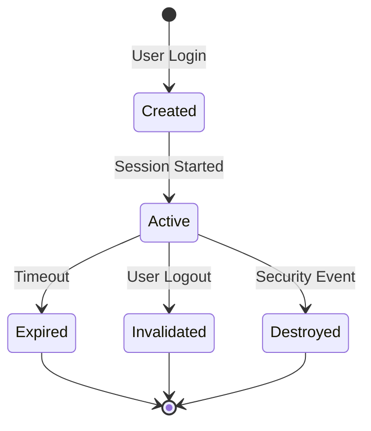
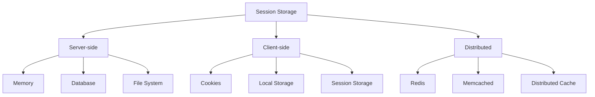
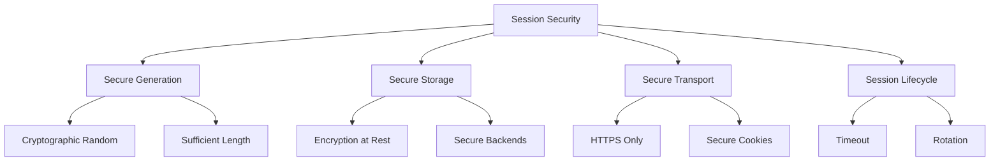
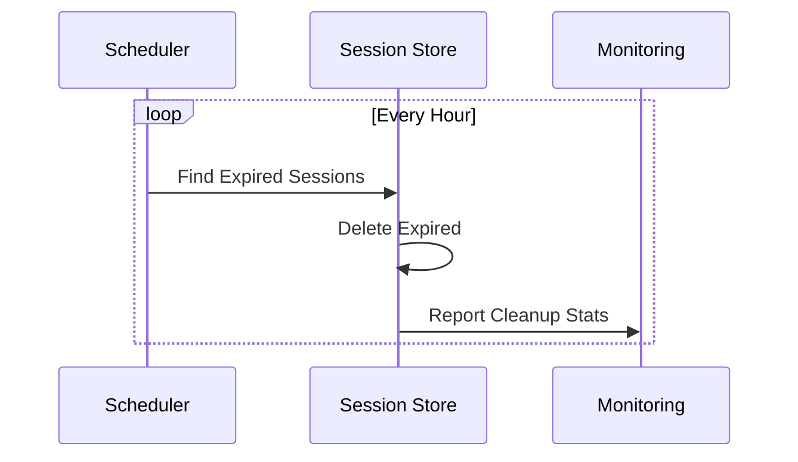

# Session Management

Last Updated: 2025-01-15

## Overview
Session management is crucial for maintaining user state in web applications. It involves creating, maintaining, and destroying user sessions securely while protecting against various attacks.

## Session Lifecycle



## Session Storage Types



## Implementation

### 1. Server-Side Session Management
```python
from datetime import datetime, timedelta
import secrets
from typing import Optional, Dict, Any
import redis

class SessionManager:
    def __init__(
        self,
        redis_host: str = 'localhost',
        redis_port: int = 6379,
        session_timeout: int = 3600  # 1 hour
    ):
        self.redis = redis.Redis(
            host=redis_host,
            port=redis_port,
            decode_responses=True
        )
        self.session_timeout = session_timeout
    
    def create_session(
        self,
        user_id: str,
        metadata: Dict[str, Any] = None
    ) -> str:
        """Create a new session"""
        session_id = secrets.token_urlsafe(32)
        session_data = {
            'user_id': user_id,
            'created_at': datetime.utcnow().isoformat(),
            'last_accessed': datetime.utcnow().isoformat()
        }
        
        if metadata:
            session_data.update(metadata)
        
        # Store session in Redis
        self.redis.hmset(
            f'session:{session_id}',
            session_data
        )
        self.redis.expire(
            f'session:{session_id}',
            self.session_timeout
        )
        
        return session_id
    
    def get_session(
        self,
        session_id: str
    ) -> Optional[Dict[str, Any]]:
        """Get session data"""
        session_key = f'session:{session_id}'
        
        if not self.redis.exists(session_key):
            return None
        
        # Update last accessed time
        self.redis.hset(
            session_key,
            'last_accessed',
            datetime.utcnow().isoformat()
        )
        
        # Reset expiration
        self.redis.expire(session_key, self.session_timeout)
        
        return self.redis.hgetall(session_key)
    
    def destroy_session(self, session_id: str):
        """Destroy a session"""
        self.redis.delete(f'session:{session_id}')
```

### 2. Secure Cookie Implementation
```python
from cryptography.fernet import Fernet
import json
from typing import Optional, Dict

class SecureCookieManager:
    def __init__(self, secret_key: bytes):
        self.fernet = Fernet(secret_key)
    
    def create_secure_cookie(
        self,
        data: Dict[str, Any],
        expires_in: int = 3600
    ) -> str:
        """Create an encrypted cookie"""
        cookie_data = {
            'data': data,
            'expires': (
                datetime.utcnow() + timedelta(seconds=expires_in)
            ).timestamp()
        }
        
        # Encrypt cookie data
        encrypted_data = self.fernet.encrypt(
            json.dumps(cookie_data).encode()
        )
        return encrypted_data.decode()
    
    def read_secure_cookie(
        self,
        cookie_value: str
    ) -> Optional[Dict[str, Any]]:
        """Read and verify an encrypted cookie"""
        try:
            decrypted_data = self.fernet.decrypt(
                cookie_value.encode()
            )
            cookie_data = json.loads(decrypted_data)
            
            # Check expiration
            if datetime.utcnow().timestamp() > cookie_data['expires']:
                return None
            
            return cookie_data['data']
        except Exception:
            return None
```

### 3. Session Middleware
```python
from functools import wraps
from flask import request, g, abort

class SessionMiddleware:
    def __init__(
        self,
        session_manager: SessionManager,
        cookie_manager: SecureCookieManager
    ):
        self.session_manager = session_manager
        self.cookie_manager = cookie_manager
    
    def session_required(self, f):
        @wraps(f)
        def decorated_function(*args, **kwargs):
            session_cookie = request.cookies.get('session')
            if not session_cookie:
                abort(401)
            
            # Decrypt cookie
            cookie_data = self.cookie_manager.read_secure_cookie(
                session_cookie
            )
            if not cookie_data:
                abort(401)
            
            # Get session
            session_data = self.session_manager.get_session(
                cookie_data['session_id']
            )
            if not session_data:
                abort(401)
            
            # Store in request context
            g.session = session_data
            return f(*args, **kwargs)
        
        return decorated_function
```

## Session Security

### Security Measures



### Implementation
```python
class SecureSessionManager:
    def __init__(
        self,
        redis_host: str = 'localhost',
        redis_port: int = 6379,
        max_sessions_per_user: int = 5
    ):
        self.redis = redis.Redis(
            host=redis_host,
            port=redis_port,
            decode_responses=True
        )
        self.max_sessions = max_sessions_per_user
    
    def create_session(
        self,
        user_id: str,
        device_info: Dict[str, str]
    ) -> str:
        """Create secure session with device binding"""
        # Check active sessions
        active_sessions = self.get_user_sessions(user_id)
        if len(active_sessions) >= self.max_sessions:
            # Remove oldest session
            oldest_session = min(
                active_sessions.items(),
                key=lambda x: x[1]['created_at']
            )
            self.destroy_session(oldest_session[0])
        
        # Create new session
        session_id = secrets.token_urlsafe(32)
        session_data = {
            'user_id': user_id,
            'device_fingerprint': self._create_device_fingerprint(
                device_info
            ),
            'created_at': datetime.utcnow().isoformat(),
            'last_accessed': datetime.utcnow().isoformat(),
            'ip_address': device_info.get('ip_address')
        }
        
        # Store session
        self.redis.hmset(f'session:{session_id}', session_data)
        self.redis.sadd(f'user_sessions:{user_id}', session_id)
        
        return session_id
    
    def validate_session(
        self,
        session_id: str,
        device_info: Dict[str, str]
    ) -> bool:
        """Validate session with device binding"""
        session_data = self.get_session(session_id)
        if not session_data:
            return False
        
        # Verify device fingerprint
        current_fingerprint = self._create_device_fingerprint(
            device_info
        )
        if session_data['device_fingerprint'] != current_fingerprint:
            self.destroy_session(session_id)
            return False
        
        return True
    
    def _create_device_fingerprint(
        self,
        device_info: Dict[str, str]
    ) -> str:
        """Create unique device fingerprint"""
        fingerprint_data = (
            f"{device_info.get('user_agent', '')}"
            f"{device_info.get('ip_address', '')}"
            f"{device_info.get('screen_resolution', '')}"
        )
        return hashlib.sha256(
            fingerprint_data.encode()
        ).hexdigest()
```

## Session Storage Backends

### 1. Redis Implementation
```python
class RedisSessionStore:
    def __init__(
        self,
        redis_host: str = 'localhost',
        redis_port: int = 6379
    ):
        self.redis = redis.Redis(
            host=redis_host,
            port=redis_port,
            decode_responses=True
        )
    
    def store_session(
        self,
        session_id: str,
        data: Dict[str, Any],
        expires_in: int
    ):
        """Store session in Redis"""
        self.redis.hmset(f'session:{session_id}', data)
        self.redis.expire(f'session:{session_id}', expires_in)
    
    def get_session(
        self,
        session_id: str
    ) -> Optional[Dict[str, Any]]:
        """Get session from Redis"""
        return self.redis.hgetall(f'session:{session_id}')
    
    def delete_session(self, session_id: str):
        """Delete session from Redis"""
        self.redis.delete(f'session:{session_id}')
```

### 2. Database Implementation
```python
from sqlalchemy import create_engine, Table, Column, String, DateTime
from sqlalchemy.ext.declarative import declarative_base
from sqlalchemy.orm import sessionmaker

Base = declarative_base()

class SessionModel(Base):
    __tablename__ = 'sessions'
    
    session_id = Column(String, primary_key=True)
    user_id = Column(String, nullable=False)
    data = Column(String, nullable=False)
    created_at = Column(DateTime, nullable=False)
    expires_at = Column(DateTime, nullable=False)

class DatabaseSessionStore:
    def __init__(self, database_url: str):
        self.engine = create_engine(database_url)
        Base.metadata.create_all(self.engine)
        self.Session = sessionmaker(bind=self.engine)
    
    def store_session(
        self,
        session_id: str,
        user_id: str,
        data: Dict[str, Any],
        expires_in: int
    ):
        """Store session in database"""
        session = self.Session()
        try:
            session_model = SessionModel(
                session_id=session_id,
                user_id=user_id,
                data=json.dumps(data),
                created_at=datetime.utcnow(),
                expires_at=datetime.utcnow() + timedelta(
                    seconds=expires_in
                )
            )
            session.add(session_model)
            session.commit()
        finally:
            session.close()
```

## Session Cleanup

### Cleanup Process



### Implementation
```python
class SessionCleanup:
    def __init__(self, session_store):
        self.session_store = session_store
    
    async def cleanup_expired_sessions(self):
        """Clean up expired sessions"""
        try:
            # Find expired sessions
            expired_sessions = await self.session_store.find_expired()
            
            # Delete expired sessions
            for session_id in expired_sessions:
                await self.session_store.delete_session(session_id)
            
            return len(expired_sessions)
        except Exception as e:
            logger.error(f"Session cleanup failed: {e}")
            return 0
```

## Best Practices

### 1. Security Headers
```python
class SecurityHeaders:
    @staticmethod
    def get_security_headers() -> Dict[str, str]:
        """Get recommended security headers"""
        return {
            'Strict-Transport-Security':
                'max-age=31536000; includeSubDomains',
            'X-Content-Type-Options': 'nosniff',
            'X-Frame-Options': 'DENY',
            'X-XSS-Protection': '1; mode=block',
            'Content-Security-Policy':
                "default-src 'self'; frame-ancestors 'none'",
            'Cache-Control':
                'no-cache, no-store, must-revalidate',
            'Pragma': 'no-cache'
        }
```

### 2. Cookie Settings
```python
class SecureCookieSettings:
    @staticmethod
    def get_cookie_options() -> Dict[str, Any]:
        """Get secure cookie options"""
        return {
            'secure': True,  # HTTPS only
            'httponly': True,  # No JavaScript access
            'samesite': 'Strict',  # CSRF protection
            'path': '/',
            'domain': None,  # Current domain only
            'max_age': 3600  # 1 hour
        }
```

## Common Pitfalls

### 1. Security Issues
```python
# BAD: Insecure session ID generation
def bad_session_id():
    return str(random.randint(1000, 9999))

# GOOD: Secure session ID generation
def good_session_id():
    return secrets.token_urlsafe(32)

# BAD: Session fixation vulnerability
def bad_session_handling():
    if 'session_id' in request.args:
        session_id = request.args['session_id']
    else:
        session_id = create_session()

# GOOD: Session handling
def good_session_handling():
    if user.is_authenticated:
        session_id = create_new_session()
        invalidate_old_sessions(user.id)
```

### 2. Implementation Issues
```python
# BAD: No session expiration
def bad_session_store(session_id, data):
    redis.hmset(f'session:{session_id}', data)

# GOOD: Session with expiration
def good_session_store(session_id, data, expires_in):
    redis.hmset(f'session:{session_id}', data)
    redis.expire(f'session:{session_id}', expires_in)
```

## Debugging Tips

### 1. Session Debugging
```python
def debug_session(session_id: str) -> Dict[str, Any]:
    """Debug session issues"""
    try:
        session_data = session_store.get_session(session_id)
        return {
            'exists': bool(session_data),
            'data': session_data,
            'ttl': session_store.get_ttl(session_id),
            'created_at': session_data.get('created_at'),
            'last_accessed': session_data.get('last_accessed')
        }
    except Exception as e:
        return {'error': str(e)}
```

### 2. Cookie Debugging
```python
def debug_cookie(cookie_value: str) -> Dict[str, Any]:
    """Debug cookie issues"""
    try:
        cookie_data = cookie_manager.read_secure_cookie(
            cookie_value
        )
        return {
            'valid': bool(cookie_data),
            'decrypted_data': cookie_data,
            'expires_in': (
                cookie_data['expires'] - datetime.utcnow().timestamp()
                if cookie_data else None
            )
        }
    except Exception as e:
        return {'error': str(e)}
```
